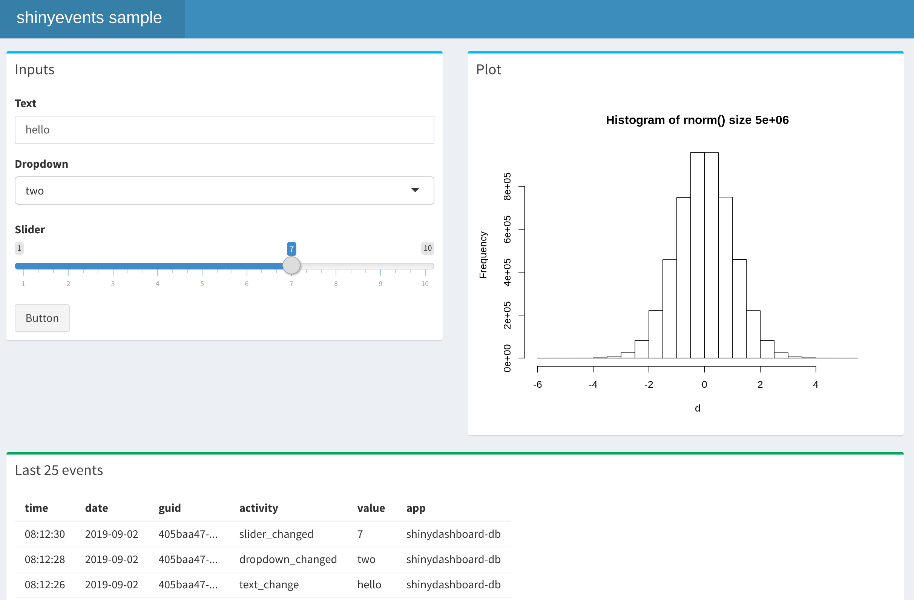

<!-- README.md is generated from README.Rmd. Please edit that file -->

# shinyevents

<!-- badges: start -->

[](https://www.tidyverse.org/lifecycle/#experimental)
<!-- badges: end -->

  - [Installation](#installation)
  - [Event tracking](#event-tracking)
      - [CSV example](#csv-example)
      - [Database example](#database-example)
  - [Sample apps](#sample-apps)

The goal of `shinyevents` is to provide an easy way to log events
occurring within a Shiny app. The logged events can later be analyzed to
help determine things such possible improvement opportunities for an
app, as well how end-users actually interact with the app itself.

## Installation

The development version of `shinyevents` is available on
[GitHub](https://github.com/):

``` r
# install.packages("remotes")
remotes::install_github("edgararuiz/shinyevents")
```

## Event tracking

``` r
library(shinyevents)

tracker <- shiny_events_to_log()
```

``` r
tracker$app
#> [1] "shinyevents"
tracker$guid
#> [1] "d1c6d274-2490-43c0-88c5-f9f1eac6f983"
```

``` r
tracker$entry()
#> $guid
#> [1] "d1c6d274-2490-43c0-88c5-f9f1eac6f983"
#> 
#> $app
#> [1] "shinyevents"
#> 
#> $datetime
#> [1] "2019-09-02 08:55:35 CDT"
#> 
#> $activity
#> [1] ""
#> 
#> $value
#> [1] ""
```

``` r
tracker$event("example", "readme")
```

``` r
readLines("shiny-events.log")
#> [1] "2019-09-02 08:55:35 CDT INFO shinyevents d1c6d274-2490-43c0-88c5-f9f1eac6f983 example readme "
```

``` r
tracker$event("start_app")
tracker$event("slider", "3")
tracker$event("stop_app")
```

``` r
readLines("shiny-events.log")
#> [1] "2019-09-02 08:55:35 CDT INFO shinyevents d1c6d274-2490-43c0-88c5-f9f1eac6f983 example readme "
#> [2] "2019-09-02 08:55:35 CDT INFO shinyevents d1c6d274-2490-43c0-88c5-f9f1eac6f983 start_app  "    
#> [3] "2019-09-02 08:55:35 CDT INFO shinyevents d1c6d274-2490-43c0-88c5-f9f1eac6f983 slider 3 "      
#> [4] "2019-09-02 08:55:35 CDT INFO shinyevents d1c6d274-2490-43c0-88c5-f9f1eac6f983 stop_app  "
```

## CSV example

``` r
tracker <- shiny_events_to_csv()
tracker$event("start_app")
tracker$event("slider", "3")
tracker$event("stop_app")
```

``` r
read.csv(
  "shiny-events.csv",
  stringsAsFactors = FALSE,
  col.names = c("guid", "app", "activity", "value", "datetime")
)
#>                                   guid         app  activity value
#> 1 70659b75-bac4-4a68-b511-fa8c952d294a shinyevents start_app    NA
#> 2 70659b75-bac4-4a68-b511-fa8c952d294a shinyevents    slider     3
#> 3 70659b75-bac4-4a68-b511-fa8c952d294a shinyevents  stop_app    NA
#>                  datetime
#> 1 2019-09-02 08:55:35 CDT
#> 2 2019-09-02 08:55:35 CDT
#> 3 2019-09-02 08:55:35 CDT
```

## Database example

``` r
library(DBI)
library(RSQLite)

con <- dbConnect(SQLite(), "example.db")
```

``` r
tracker <- shiny_events_to_dbi(table = "shinyevents", connection = con)
tracker$event("start_app")
tracker$event("slider", "3")
tracker$event("stop_app")
```

``` r
dbGetQuery(con, "SELECT * FROM shinyevents")
#>                                   guid         app                datetime
#> 1 8e3a9632-f76b-4ba9-b35a-fad6655bdba2 shinyevents 2019-09-02 08:55:36 CDT
#> 2 8e3a9632-f76b-4ba9-b35a-fad6655bdba2 shinyevents 2019-09-02 08:55:36 CDT
#> 3 8e3a9632-f76b-4ba9-b35a-fad6655bdba2 shinyevents 2019-09-02 08:55:36 CDT
#>    activity value
#> 1 start_app      
#> 2    slider     3
#> 3  stop_app
```

``` r
dbDisconnect(con)
```

## Sample apps

The package includes several app examples. The example pictured below,
uses `shiny_events_to_dbi()` to record the events in a database, in this
case SQLite. It records when there are changes in each of the inputs, as
well as when the plot;s code starts and ends. There are entries for when
the app starts and is closed.



<br/>

Run the following code in your R session to access the app:

``` r
shiny::runApp(
  system.file(
    "samples", "shinydashboard-db", 
    package = "shinyevents"
    ), 
  display.mode = "normal"
  )
```

### Additional samples

  - *Simple example* - An example using the “Old Faithful Geyser” app,
    shows the easiest way to include `shinyevents` in an app.
    
    ``` r
    shiny::runApp(
      system.file(
        "samples", "simple", 
        package = "shinyevents"
        ), 
      display.mode = "normal"
      )
    ```

  - *shinydashboard* - An example that looks the same as the
    `shinydashboard` example above, but it uses a CSV file to record the
    events instead of a database.
    
    ``` r
    shiny::runApp(
      system.file(
        "samples", "shinydashboard", 
        package = "shinyevents"
        ), 
      display.mode = "normal"
      )
    ```
